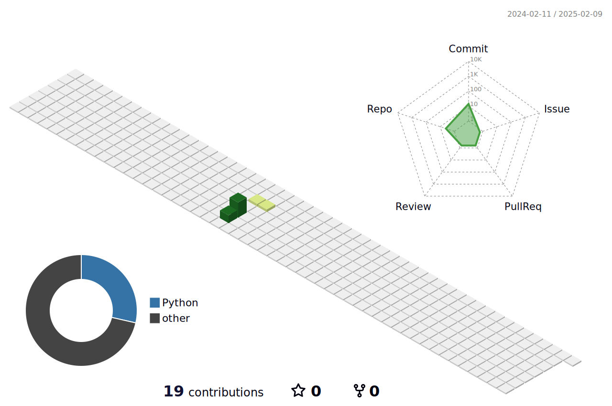

<div align="center">
  <a href="https://blog.sunguoqi.com/">
    
  </a>
</div>

## Hi, 👋 I'm Wade

- 🌱 目前正在学习 `Vue3` 、 `Vite` 和 `TypeScript`
- 📫 联系方式: 295645351@qq.com

### Languaues and Tools

<span > 
   
   
   
   
   
   
   
   
   
    
</span>

### My GitHub Contributions


### My GitHub Stats

<div align="left">
   
  
</div>
<div align="left">
  
</div>

### My Activities

<!--START_SECTION:waka-->

```txt
From: 11 July 2023 - To: 10 July 2024

Total Time: 1,222 hrs 35 mins

Vue.js                     648 hrs 6 mins  █████████████▒░░░░░░░░░░░   53.01 %
TypeScript                 387 hrs 49 mins ████████░░░░░░░░░░░░░░░░░   31.72 %
JavaScript                 88 hrs 42 mins  █▓░░░░░░░░░░░░░░░░░░░░░░░   07.26 %
JSON                       41 hrs 58 mins  █░░░░░░░░░░░░░░░░░░░░░░░░   03.43 %
Markdown                   30 hrs 7 mins   ▓░░░░░░░░░░░░░░░░░░░░░░░░   02.46 %
Other                      8 hrs 40 mins   ▒░░░░░░░░░░░░░░░░░░░░░░░░   00.71 %
```

<!--END_SECTION:waka-->

### My GitHub Contributions


